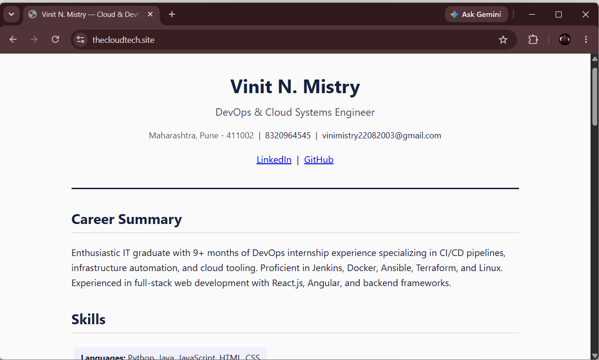
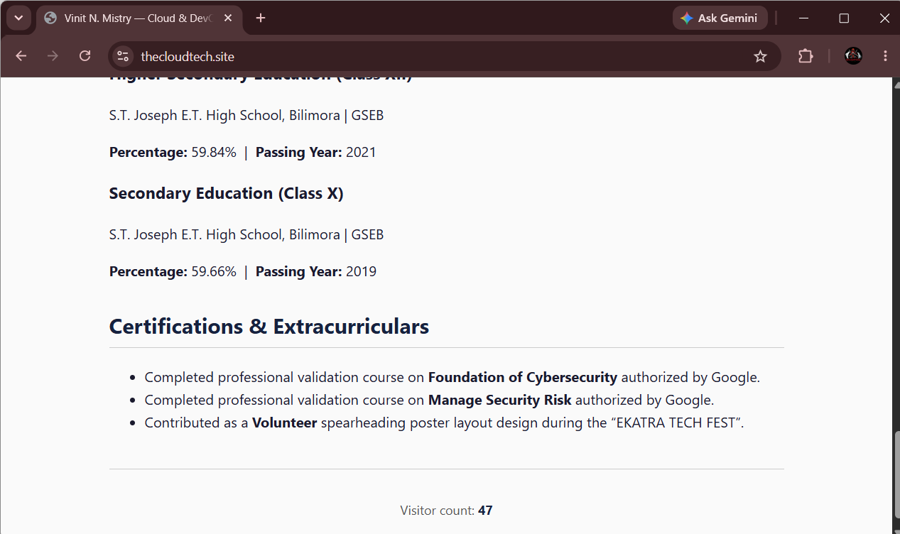
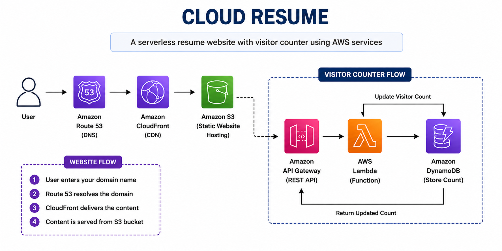

# ☁️ Cloud Resume Challenge — `thecloudtech.site`

> 🚀 **A production-style serverless resume website built entirely on AWS**, featuring global content delivery, HTTPS, a custom domain, and a real-time visitor counter powered by AWS Lambda and DynamoDB.

---

## 🌐 Website Output

<p align="center">
  
</p>

<p align="center">
  
</p>

## ✨ Project Overview

This project is a fully **serverless resume website** built using AWS managed services.

The frontend is hosted in a **private Amazon S3 bucket** and delivered globally through **Amazon CloudFront**. DNS is managed using **Amazon Route 53**, while the visitor counter is powered by **API Gateway → Lambda → DynamoDB**.

### 🎯 Key Features

* ☁️ **100% Serverless AWS Architecture**
* 🌍 **Global Content Delivery with CloudFront**
* 🔐 **Private S3 Bucket with Origin Access Control**
* 🔒 **HTTPS using AWS Certificate Manager**
* 🌐 **Custom Domain using Route 53**
* 👥 **Live Visitor Counter**
* ⚡ **Serverless API using API Gateway + Lambda**
* 🗄️ **DynamoDB for persistent visitor count**
* 🛡️ **Least-Privilege IAM Permissions**
* 🚀 **CloudFront Cache Invalidation**
* 💰 **Low-cost architecture with no EC2**

---

# 🏗️ Architecture

<p align="center">
  
</p>

# ☁️ AWS Services

| 🔧 Service         | 🎯 Purpose                                  |
| ------------------ | ------------------------------------------- |
| 🌐 **Route 53**    | DNS management and root-domain Alias record |
| ⚡ **CloudFront**   | Global CDN, caching and HTTPS               |
| 📦 **S3**          | Private static website storage              |
| 🔒 **ACM**         | SSL/TLS certificate                         |
| 🚪 **API Gateway** | HTTP API for visitor counter                |
| λ **Lambda**       | Serverless backend                          |
| 🗄️ **DynamoDB**   | Visitor counter storage                     |
| 🛡️ **IAM**        | Least-privilege access control              |

---

# 📁 Project Structure

```text
☁️ cloud-resume-challenge/
│
├── 📂 frontend/
│   ├── 📄 index.html
│   ├── 🎨 style.css
│   └── ⚡ script.js
│
├── 🐍 lambda_function.py
├── 🔐 lambda-dynamodb-policy.json
└── 📖 README.md
```

---

# 🛠️ Implementation

## 1️⃣ 🗄️ DynamoDB

Created a DynamoDB table:

```text
📌 Table: VisitorCount
🔑 Partition Key: id
📊 Type: String
```

Initial item:

```json
{
  "id": "counter",
  "count": 0
}
```

The table stores a single visitor-counter item.

---

## 2️⃣ λ AWS Lambda

Created the function:

```text
⚡ updateVisitorCount
🐍 Runtime: Python 3.12
```

The function performs an atomic DynamoDB update:

```text
GET /count
     │
     ▼
API Gateway
     │
     ▼
Lambda
     │
     ▼
DynamoDB
     │
     ├── count = count + 1
     │
     ▼
Return updated count
```

---

## 3️⃣ 🛡️ IAM — Least Privilege

The Lambda execution role was configured with only the permissions required for the counter.

```text
✅ dynamodb:GetItem
✅ dynamodb:UpdateItem
```

Access is restricted specifically to the:

```text
🗄️ VisitorCount
```

table.

> 🔐 **Security principle:** Grant only the permissions required to perform the task.

---

## 4️⃣ 🚪 API Gateway

Created an **HTTP API** with:

```text
GET /count
```

Request flow:

```text
🌐 Browser
    ↓
🚪 API Gateway
    ↓
λ Lambda
    ↓
🗄️ DynamoDB
```

CORS configuration:

```text
Allowed Origin  → *
Allowed Methods → GET, OPTIONS
```

Example response:

```json
{
  "count": 42
}
```

Every page load increments the counter.

---

## 5️⃣ 🎨 Frontend

Frontend technologies:

```text
🌐 HTML
🎨 CSS
⚡ JavaScript
```

The JavaScript application calls the API Gateway endpoint when the page loads.

```text
Page Load
    ↓
script.js
    ↓
GET /count
    ↓
API Gateway
    ↓
Lambda
    ↓
DynamoDB
    ↓
Updated Count
    ↓
Display on Website
```

---

## 6️⃣ 📦 Amazon S3

The website files are stored in a **private S3 bucket**.

```text
📦 Bucket
└── thecloudtech.site
```

### 🔐 Security

```text
🚫 Public Access
🚫 S3 Website Endpoint

✅ Block Public Access
✅ CloudFront OAC
✅ HTTPS
```

CloudFront is the only service allowed to access the S3 objects.

---

## 7️⃣ 🔒 AWS Certificate Manager

Created a public SSL/TLS certificate for:

```text
🔗 thecloudtech.site
```

Certificate region:

```text
📍 us-east-1
```

Validation method:

```text
DNS Validation
```

Status:

```text
✅ Issued
```

---

## 8️⃣ ⚡ CloudFront

CloudFront was configured as the public entry point for the website.

```text
🌐 Custom Domain
      ↓
⚡ CloudFront
      ↓
📦 Private S3
```

### Configuration

```text
Origin              → S3
Origin Access       → OAC
Default Root Object → index.html
HTTPS               → Enabled
WAF                 → Disabled
Custom Domain       → thecloudtech.site
```

CloudFront provides:

* 🌍 Global edge locations
* ⚡ Low-latency delivery
* 🔒 HTTPS
* 💾 Edge caching
* 🔐 Secure S3 access

---

## 9️⃣ 🌐 Route 53

Initially, DNS was managed through GoDaddy.

### ❌ Problem

The root domain could not directly use a standard CNAME record pointing to CloudFront.

```text
thecloudtech.site
       │
       ✖ Standard CNAME
       │
       ▼
CloudFront
```

### ✅ Solution

DNS management was migrated to Route 53.

```text
🌐 Route 53
     │
     ▼
A Record — Alias
     │
     ▼
⚡ CloudFront
```

This allowed the root domain to point directly to the CloudFront distribution.

---

# 🐛 Troubleshooting

Real AWS configuration issues were encountered during the implementation.

### 🔴 1. ACM DNS Validation

**Problem:**
GoDaddy rejected the ACM validation CNAME for the `www` hostname.

**Solution:**
The initial implementation was configured using only the root domain.

```text
✅ thecloudtech.site
❌ www.thecloudtech.site
```

---

### 🔴 2. CloudFront `AccessDenied`

**Problem:**

```text
❌ AccessDenied
```

CloudFront could not retrieve objects from S3.

**Root Cause:**
The S3 bucket policy did not correctly allow CloudFront's OAC.

**Solution:**
Applied the CloudFront-generated OAC bucket policy.

```text
CloudFront
    │
    │ 🔐 OAC
    ▼
Private S3
    │
    ▼
index.html
```

---

### 🔴 3. Root Domain DNS Issue

**Problem:**

GoDaddy could not configure the required root-domain mapping to CloudFront.

**Solution:**

```text
GoDaddy
   │
   │ DNS delegation
   ▼
Route 53
   │
   │ Alias A Record
   ▼
CloudFront
```

---

### 🔴 4. CloudFront Cache

**Problem:**

Updated HTML files were uploaded to S3, but the old version was still displayed.

**Root Cause:**

CloudFront was serving the cached object.

**Solution:**

Created an invalidation:

```text
/* 
```

Result:

```text
S3 Update
   ↓
CloudFront Invalidation
   ↓
Edge Cache Cleared
   ↓
Updated Website 🚀
```

---

# 🔐 Security Architecture

```text
                 🌐 Internet
                      │
                      ▼
                ⚡ CloudFront
                      │
                 🔐 OAC
                      │
                      ▼
               📦 Private S3
                      │
                      │
                 🔒 No Public
                    Access
```

### Security Measures

* 🔐 S3 Block Public Access enabled
* 🔒 CloudFront Origin Access Control
* 🛡️ Least-privilege IAM
* 🔒 HTTPS everywhere
* 🚫 No public EC2 server
* 🎯 Lambda permissions restricted to one DynamoDB table

---

# 🎤 Interview Summary

> 💬 **"I built a serverless resume website using AWS. The frontend is hosted in a private S3 bucket and delivered globally through CloudFront with HTTPS. Route 53 manages the custom domain, and ACM provides the SSL certificate.**
>
> **For the visitor counter, I implemented an HTTP API using API Gateway that triggers a Python Lambda function. Lambda atomically increments the visitor count stored in DynamoDB and returns the updated value to the frontend.**
>
> **I followed the principle of least privilege by restricting Lambda's IAM permissions to only the required DynamoDB operations on the specific counter table.**
>
> **One of the main challenges was configuring the root domain with CloudFront. Since GoDaddy did not support the required apex-domain configuration, I migrated DNS management to Route 53 and used an Alias record. I also resolved CloudFront OAC permission issues and cache invalidation problems."**

---

# ❓ Common Interview Questions

### ❓ Why not EC2?

> Because the application does not require a continuously running server. A serverless architecture reduces infrastructure management, automatically scales, and is more cost-efficient for low traffic.

### ❓ Why CloudFront?

> CloudFront provides global content delivery, caching, HTTPS termination, and secure integration with S3 through Origin Access Control.

### ❓ Why DynamoDB?

> The application has a simple key-value access pattern where a single counter needs to be updated and retrieved. DynamoDB is a natural serverless fit.

### ❓ Why Lambda?

> Lambda executes only when the visitor counter API is called, eliminating the need for a continuously running backend server.

### ❓ What triggers Lambda?

```text
Browser
   ↓
GET /count
   ↓
API Gateway
   ↓
Lambda
```

### ❓ Why HTTP API instead of REST API?

> HTTP API provides the functionality required by this project with a simpler architecture and lower cost compared with a REST API.

### ❓ Why keep S3 private?

> To prevent direct public access to the website files. CloudFront accesses the bucket through Origin Access Control.

### ❓ Why Route 53?

> Route 53 provides Alias records that allow the root domain to point directly to AWS resources such as CloudFront.

---

# 🚀 Future Improvements

## 🏗️ Infrastructure as Code

Automate the entire infrastructure using:

```text
Terraform
AWS SAM
AWS CDK
```

---

## 🔄 CI/CD Pipeline

Implement GitHub Actions:

```text
👨‍💻 Developer
     │
     ▼
🐙 GitHub Push
     │
     ▼
⚙️ GitHub Actions
     │
     ├── 📦 Upload to S3
     │
     └── ⚡ CloudFront Invalidation
             │
             ▼
        🌍 Production
```

---

## 📊 Monitoring

Add:

* 📈 CloudWatch Metrics
* 📝 CloudWatch Logs
* 🚨 CloudWatch Alarms
* 🔍 Application monitoring

---

## 🌐 Custom Domain Enhancement

Add support for:

```text
thecloudtech.site
www.thecloudtech.site
```

using an ACM certificate covering both domains.

---

# 🧠 Skills Demonstrated

### ☁️ AWS / Cloud

`S3` · `CloudFront` · `Route 53` · `ACM` · `API Gateway` · `Lambda` · `DynamoDB`

### ⚙️ DevOps

`IAM` · `CDN` · `DNS` · `Serverless` · `Caching` · `Deployment`

### 🔐 Security

`OAC` · `HTTPS` · `Least Privilege` · `Private S3`

### 💻 Development

`HTML` · `CSS` · `JavaScript` · `Python` · `REST API`

---

# 🏆 Project Highlights

```text
☁️ Serverless AWS Architecture
🌍 Global CDN with CloudFront
🔒 Private S3 + OAC
🌐 Custom Domain + HTTPS
👥 Real-time Visitor Counter
λ Lambda Backend
🗄️ DynamoDB Storage
🛡️ Least-Privilege IAM
🐛 Real-world AWS Troubleshooting
🚀 Deployment & Cache Management
```

---

# 🔮 Next Version

The next iteration will automate both infrastructure and deployment:

```text
                    👨‍💻 Developer
                         │
                         ▼
                    🐙 GitHub
                         │
                         ▼
                  ⚙️ GitHub Actions
                         │
                         ▼
                    🏗️ Terraform
                         │
              ┌──────────┴──────────┐
              ▼                     ▼
        ☁️ AWS Infrastructure    📦 S3
              │                     │
              └──────────┬──────────┘
                         ▼
                    ⚡ CloudFront
                         │
                         ▼
                    🌍 Production
```

> ⭐ **This project demonstrates practical experience with AWS serverless architecture, cloud security, DNS, CDN, API integration, IAM, and real-world troubleshooting.**

---

## 🔗 Live Project

🌐 **https://thecloudtech.site**

⭐ *Built with AWS • Serverless • Secure • Scalable • Cost Efficient*
